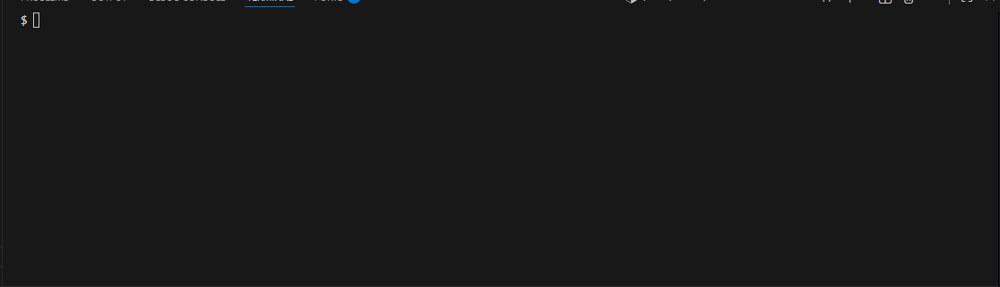

[](https://app.codecrafters.io/users/codecrafters-bot?r=2qF)

# POSIX Shell Implementation

A custom command-line interpreter written in **C++23**.
This project implements core shell functionalities including process management, inter-process communication (pipelines), and a custom auto-completion engine.

Based on the ["Build Your Own Shell"](https://codecrafters.io/challenges/shell) challenge by CodeCrafters.



## Features

* **Process Control:** Manual management of child processes using standard POSIX system calls (`fork`, `execvp`, `waitpid`).
* **Pipelines:** Implementation of command chaining (`cmd1 | cmd2`) using `pipe()` and `dup2()` for file descriptor manipulation.
* **Auto-Completion:** Custom **Trie data structure** to efficiently index and retrieve executables and file paths for tab-completion.

## Tech Stack

* **Language:** C++
* **Platform:** Linux (Ubuntu/Debian/WSL)
* **Build System:** CMake + Ninja
* **Dependencies:**
    * **GNU Readline:** For terminal input handling.


Start the shell and run standard commands:

##🚀 Build & Run
```bash
sudo apt update && sudo apt install build-essential cmake ninja-build libreadline-dev

# 1. Configure
cmake --preset linux-release

# 2. Build
cmake --build --preset release

# 3. Run
./build/release/shell
```